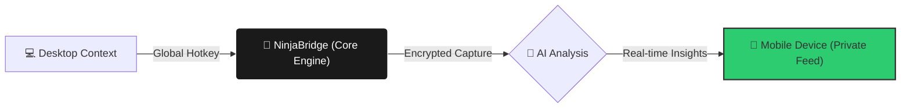

# 🥷 NinjaBridge: The Private AI Productivity Suite

**NinjaBridge** is a lightweight, open-source productivity bridge designed for real-time AI-assisted documentation and accessibility. It creates a secure, encrypted link between your desktop and your mobile device, allowing for "Off-Screen" AI analysis of your current tasks without cluttering your primary workspace.

---

## 🚀 How It Works

NinjaBridge operates as a discreet background service that captures specific screen context and routes it to your preferred AI model (Gemini, OpenAI, or Anthropic). The insights are sent directly to your mobile device via Telegram or Discord, ensuring your main screen remains clean and distraction-free.

---

## ✨ Key Features

### 👻 Discreet Execution Engine
- **Minimal Footprint:** Runs as a background process to save system resources and keep the taskbar clean.
- **Zero-Intrusion Mode:** No pop-ups, no shutter sounds, and no desktop notifications.

### 📸 Precision Context Capture
- **Global Hotkeys:** Trigger instant analysis with customizable, system-wide key bindings (e.g., `Ctrl+Shift+F1`).
- **Privacy-First Routing:** Data is processed in-memory. Screenshots are never saved to your local disk or cloud gallery; they flow directly from the API to your private mobile channel.
- **Focus Mode:** Automatically suppresses system notifications during active sessions to prevent on-screen interruptions.

### 🌌 Multi-Model Intelligence
- **BYOK (Bring Your Own Key):** Supports Google Gemini, OpenAI, and Anthropic Claude.
- **Quick Template Engine:** The UI includes built-in, pre-configured instruction sets for technical documentation, code analysis, bug hunting, and more.

---

## 📋 Integrated AI Workflows

Available directly within the **Prompts** tab via the **Quick Templates** selector:

| Workflow | Integrated Prompt Goal |
| :--- | :--- |
| **Logic Flow** | Deep analysis of code blocks for senior-level explanations. |
| **Tech Summary** | Summarization of complex technical documentation & parameters. |
| **Bug Hunt** | Detection of edge cases and security vulnerabilities. |
| **Meeting Notes** | Extraction of action items and key decisions. |
| **UI/UX Audit** | Customer journey analysis and layout improvement suggestions. |
| **Accessibility** | Visual hierarchy descriptions for screen-reader optimization. |

---

## 🛠️ Installation & Setup

### ⚡ Option 1: Fast Launch (Recommended)
Download the latest `NinjaBridge.exe` from the [releases](https://github.com/MrWatt369/ninjabridge/releases) or the `/dist` folder.
1. Run `NinjaBridge.exe`.
2. Enter your credentials.
3. Map your hotkeys and go stealth.

### 🛠️ Option 2: Build From Source
1. Clone: `git clone https://github.com/MrWatt369/ninjabridge.git`
2. Install dependencies: `pip install -r requirements.txt`
3. Run: `python main.py`

---

## 🎮 Quick Start
1. **Launch:** Open NinjaBridge and enter your API credentials.
2. **Select:** Go to the 📝 **Prompts** tab and use the **Quick Templates** dropdown to select a task.
3. **Map:** Click **REC** to record your custom global hotkey for that task.
4. **Deploy:** Click **"Go Stealth"** to move the engine to the background.
5. **Analyze:** Hit your hotkey anytime for instant AI insights on your phone.

---

## ☕ Support & Development

This project is maintained by a single developer focused on digital privacy. If NinjaBridge has improved your workflow, consider supporting the project. To maintain project independence and user privacy, we only accept crypto donations.

---

## 📜 Licensing & Commercial Use

**NinjaBridge** is open-source for personal use. For enterprise systems or secure environments where privacy and source confidentiality are critical, a **Commercial Private License** is required.

- **Option 1 (Open Source):** Standard personal use under the project framework.
- **Option 2 (Private Commercial License):** Designed for companies and professional entities. If your organization requires the use of NinjaBridge without public disclosure of integration code or for proprietary internal workflows:
    - **Commercial License Fee:** $2400/year (or a percentage of profit by agreement).
    - **Outcome:** This allows you to maintain the secrecy of your internal code and workflows while legally using the NinjaBridge engine.

Please contact the developer directly for commercial onboarding.

---

## ⚖️ Disclaimer & Ethics

NinjaBridge is intended for personal productivity, accessibility (e.g., real-time screen description for visually impaired users), and private educational research. Users are responsible for ensuring their use of this tool complies with all third-party terms of service, employment agreements, and local regulations. Use ethically.

Built with ❤️ for the privacy-conscious professional.
